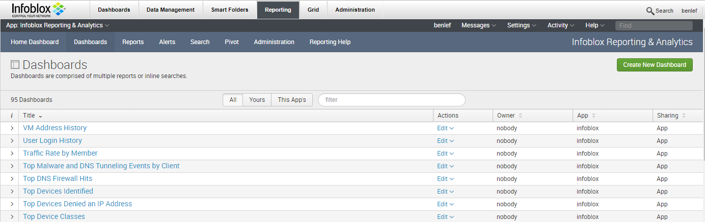
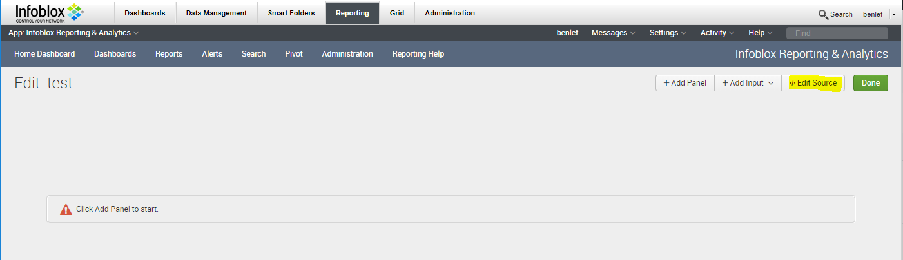
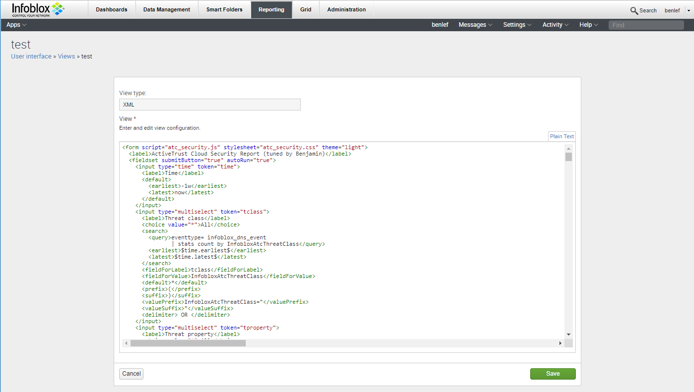
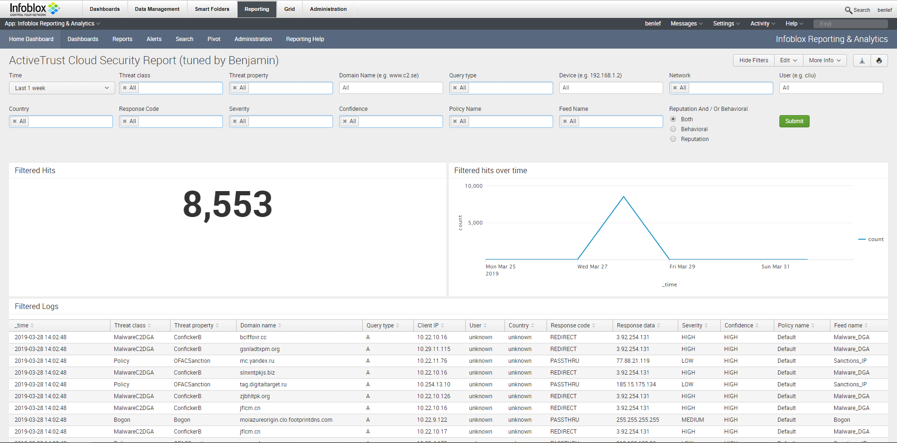
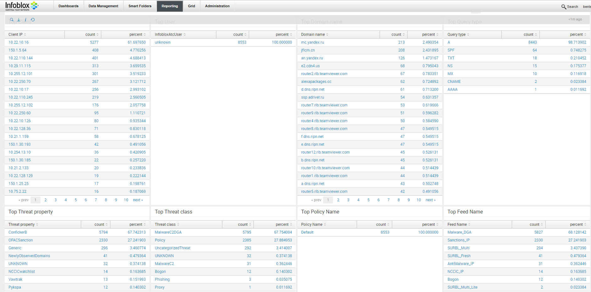

# Infoblox ActiveTrust Cloud Security Report for Reporting & Analytics

This Splunk dashboard is a modified version of offical Splunk App for Infoblox ActiveTrust Cloud (available [here](https://splunkbase.splunk.com/app/3850/)) that works out of the box with [Infoblox Reporting & Analytics](https://www.infoblox.com/products/reporting-analytics/).

With this XML file, you don't need to have a separate Splunk running.

## Release notes
* v1: initial release
* v1.1: added IP to hosname DNS lookup for Filtered Hosname & Top Client dashboards

## Getting started
### Prerequisites
* Infoblox Reporting & Analytics
* Infoblox ActiveTrust Cloud 
* Deploy the atc_threats_api.py python script as explained in the [deployment guide](https://www.infoblox.com/wp-content/uploads/infoblox-deployment-guide-activetrust-cloud-threats-api.pdf)

## Deployment
Create a new Dashboard:

Edit the source:

Insert the XML code within activetrust_cloud_security_report_wapi.xml and hit save:

Open the dashboard:

## Authors
* **Nicolas Jeanselme (Infoblox)**  - *initial work*
* **Benjamin Lefebvre (Dimension Data)** 

## Acknowledgments
* Erik Peeters (Infoblox)
* Steven Van Gijsel (Infoblox)
